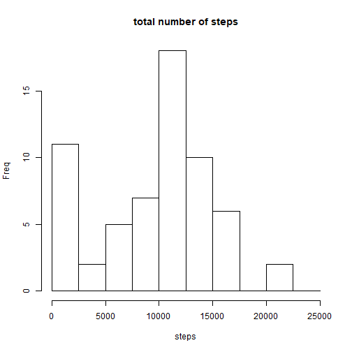
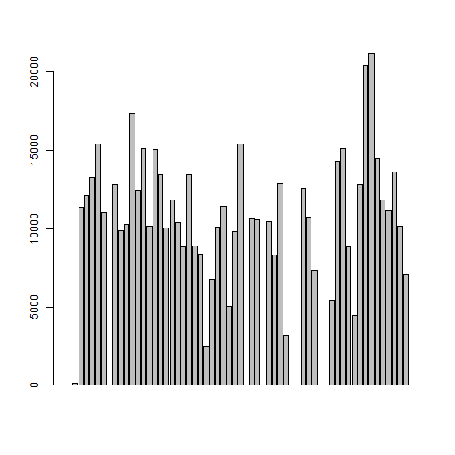
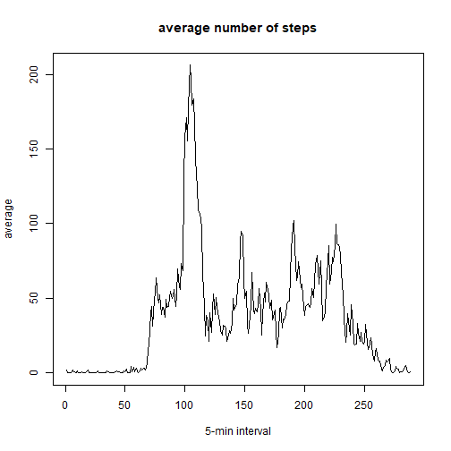
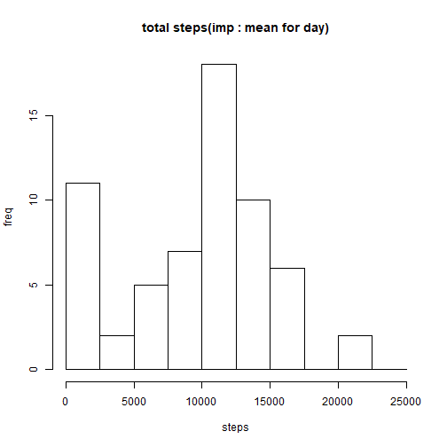
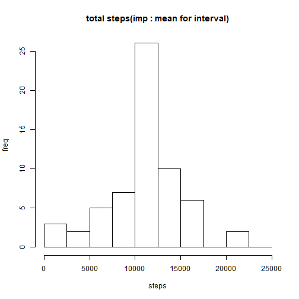
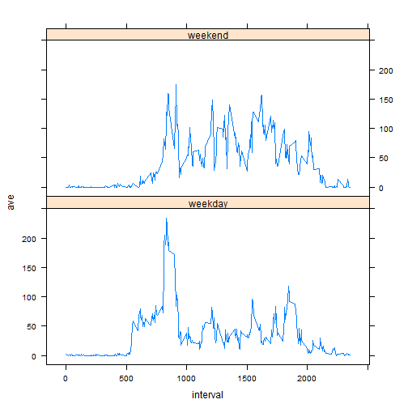

Course Project 1
==============================================================

## 1. Code for reading in the dataset and processing the data

```r
library(dplyr);  library(lattice)
workingpath <- "C:\\Users\\MED1\\Downloads\\Coursera\\repdata_data_activity"
setwd(workingpath)
data <- read.csv("activity.csv", head=TRUE)

### steps taken per day ###
data.date <- group_by(data, date)
data.date.sum <- summarise(data.date, total = sum(steps, na.rm=TRUE))
head(data.date.sum)
```

```
## # A tibble: 6 x 2
##   date       total
##   <fct>      <int>
## 1 2012-10-01     0
## 2 2012-10-02   126
## 3 2012-10-03 11352
## 4 2012-10-04 12116
## 5 2012-10-05 13294
## 6 2012-10-06 15420
```

## 2. Histogram of the total number of steps taken each day

```r
hist(data.date.sum$total, main="total number of steps", xlab="steps", ylab="Freq", breaks = seq(0, 25000, by=2500))
```



```r
barplot(data.date.sum$total)
```




## 3. Mean & median number of steps taken each day 

```r
mean(data.date.sum$total, na.rm=TRUE)
```

```
## [1] 9354.23
```

```r
median(data.date.sum$total, na.rm=TRUE)
```

```
## [1] 10395
```


## 4. Time series plot of the average number of steps taken

```r
### average daily activity pattern ###
data.int <- group_by(data, interval)
data.int.ave <- summarise(data.int, ave = mean(steps, na.rm=TRUE))
plot(data.int.ave$ave, type="l", main="average number of steps", xlab="5-min interval", ylab="average")
```




## 5. 5-minute interval that, on average, contains the maximum number of steps 

```r
which(data.int.ave$ave == max(data.int.ave$ave))
```

```
## [1] 104
```


## 6. Code to describe & show a strategy for imputing missing data 

```r
# total number of missing values 
sum(is.na(data$steps))
```

```
## [1] 2304
```

```r
# missing value - mean for that day
na.index <- which(is.na(data$steps))
na.date <- data$date[na.index];  n.na.date <- length(na.date)
data.date.ave <- summarise(data.date, ave = mean(steps, na.rm=TRUE))

na.date.index <- vector()
for(i in c(1:n.na.date)){
	na.date.index <- c(na.date.index, which(data.date.ave$date == data$date[na.index][i]))
}

data.imp.date <- data
data.imp.date$steps[na.index] <- data.date.ave$ave[na.date.index]


# missing value - mean for that interval
na.int <- data$interval[na.index];  n.na.int <- length(na.int)

na.int.index <- vector()
for(i in c(1:n.na.int)){
	na.int.index <- c(na.int.index, which(data.int.ave$interval == data$interval[na.index][i]))
}

data.imp.int <- data
data.imp.int$steps[na.index] <- data.int.ave$ave[na.int.index]
```


## 7. Histogram of the total number of steps taken each day after missing values are imputed

```r
# histogram of the imputing data : missing value - mean for that day
data.imp.date.total <- summarise( group_by(data.imp.date, date), total=sum(steps, na.rm=TRUE) )
head(data.imp.date.total)
```

```
## # A tibble: 6 x 2
##   date       total
##   <fct>      <dbl>
## 1 2012-10-01     0
## 2 2012-10-02   126
## 3 2012-10-03 11352
## 4 2012-10-04 12116
## 5 2012-10-05 13294
## 6 2012-10-06 15420
```

```r
hist(data.imp.date.total$total, breaks = seq(0, 25000, by=2500), 
                                main="total steps(imp : mean for day)", xlab="steps", ylab="freq")
```



```r
mean(data.imp.date.total$total)
```

```
## [1] 9354.23
```

```r
median(data.imp.date.total$total)
```

```
## [1] 10395
```

```r
# histogram of the imputing data : missing value - mean for that interval
data.imp.int.total <- summarise( group_by(data.imp.int, date), total=sum(steps, na.rm=TRUE) )
head(data.imp.int.total)
```

```
## # A tibble: 6 x 2
##   date        total
##   <fct>       <dbl>
## 1 2012-10-01 10766.
## 2 2012-10-02   126 
## 3 2012-10-03 11352 
## 4 2012-10-04 12116 
## 5 2012-10-05 13294 
## 6 2012-10-06 15420
```

```r
hist(data.imp.int.total$total, breaks = seq(0, 25000, by=2500), 
                                main="total steps(imp : mean for interval)", xlab="steps", ylab="freq")
```



```r
mean(data.imp.int.total$total)
```

```
## [1] 10766.19
```

```r
median(data.imp.int.total$total)
```

```
## [1] 10766.19
```


## 8. Panel plot comparing the average number of steps taken per 5-minute interval across weekdays & weekends 

```r
Sys.setlocale("LC_TIME", "English")
```

```
## [1] "English_United States.1252"
```

```r
days <- weekdays(as.Date(data.imp.date$date))

weekend.id <- sort( c( which(days=="Saturday"), which(days=="Sunday") ) )

week <- c(rep(NA, length(data$date)))
data.imp.date <- data.frame(data.imp.date, week)

data.imp.date$week[weekend.id] <- "weekend"
data.imp.date$week[-weekend.id] <- "weekday"

data.imp.date$week <- as.factor(data.imp.date$week)

data.imp.date.ave <- summarise( group_by(data.imp.date, interval, week), ave = mean(steps, na.rm=TRUE))
head(data.imp.date.ave)
```

```
## # A tibble: 6 x 3
## # Groups:   interval [3]
##   interval week      ave
##      <int> <fct>   <dbl>
## 1        0 weekday 2.33 
## 2        0 weekend 0    
## 3        5 weekday 0.462
## 4        5 weekend 0    
## 5       10 weekday 0.179
## 6       10 weekend 0
```

```r
xyplot(ave ~ interval | week, data=data.imp.date.ave, layout=c(1, 2), type="l")
```


